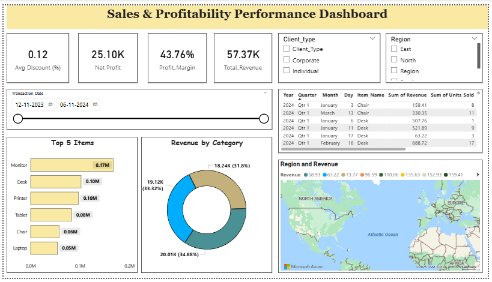

# Transaction & Clients – Sales & Profitability Performance Dashboard

## Project Overview
This Power BI project analyzes business sales data to evaluate financial performance, regional trends, and product profitability. It transforms over **10,000 transaction records** into interactive dashboards that provide clear, data-driven business insights.

---

## Objective
To build an interactive analytics dashboard that helps stakeholders:
- Monitor key financial KPIs (Revenue, Profit, Margin)
- Identify top-performing products and categories
- Analyze regional sales distribution
- Track customer and transaction trends over time

---

## Tech Stack & Tools
- **BI Tool:** Power BI Desktop  
- **Data Source:** Excel / CSV (10,000+ records)  
- **Data Transformation:** Power Query (Data Cleaning & Shaping)  
- **Analytics:** DAX (KPI Measures, Profit Margin, Revenue Calculations)  

---

## Key Features & Visuals
- **Executive KPI Cards:** Revenue, Profit, Profit Margin, Average Discount  
- **Top Products Analysis:** Identification of highest revenue-generating items  
- **Category Distribution:** Revenue contribution by product category  
- **Geographical Analysis:** Region-wise sales performance using map visuals  
- **Detailed Data Matrix:** Transaction-level breakdown by date and product  
- **Interactive Filters:** Client Type, Region, and Date slicers  

---

## Key Insights
- Monitors are the highest revenue-generating product category  
- The business maintains a strong **~43% profit margin**, indicating efficient operations  
- Revenue is fairly balanced across major product categories  
- Regional performance varies significantly, highlighting growth opportunities  

---

## Dashboard Preview

---

## How to Use This Project
1. Download the `.pbix` file from this repository  
2. Open it using **Power BI Desktop**  
3. Use filters (Region, Client Type, Date) to explore insights  

---

## Skills Demonstrated
- Data Cleaning & Transformation (Power Query)  
- Data Modeling & Relationships  
- DAX Measures & KPI Creation  
- Business Intelligence Reporting  
- Data Visualization & Storytelling  

---

## Author
Apurva Amborkar
Aspiring Data Analyst  

